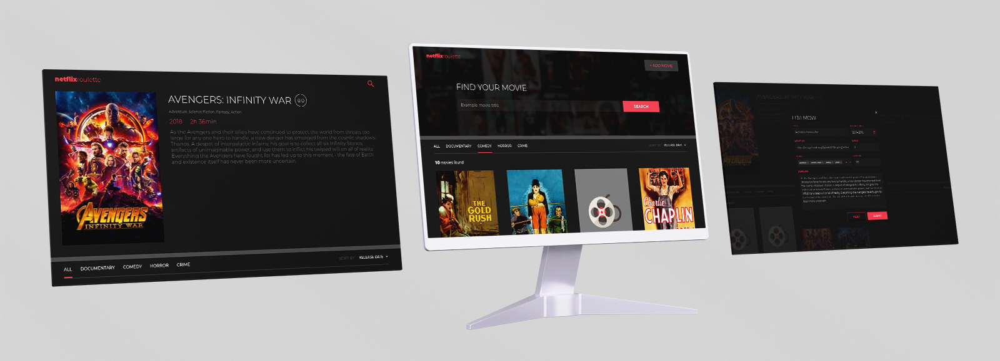

# Getting Started with Netflix Roulette App

Frontend developed by [Figma design template](https://www.figma.com/file/fKGjrOqR6nJe6LYJopGCZ8/CDP-Home-Task-%E2%80%93-React-v1). In order to use it, please clone the [backend repository](https://github.com/VarvaraZadnepriak/MoviesAPI.ReactJS) and follow instructions to start the backend server before starting the frontend. **Netflix Roulette** is a single page app (SPA), which will allow users to search, view, add and delete movies from the Movies DB database.

## Available Scripts

| Script          | Description                                                                                                                                                                            |
| --------------- | -------------------------------------------------------------------------------------------------------------------------------------------------------------------------------------- |
| `npm start`     | Runs the app in the development mode. Open [http://localhost:8080](http://localhost:8080) to view it in your browser.                                                               |
| `npm test`      | Launches the test runner in the interactive watch mode. See the section about [running tests](https://facebook.github.io/create-react-app/docs/running-tests) for more information. |
| `npm run build` | Builds the app for production to the _build_ folder. The build is minified and the filenames include the hashes.                                                                    |
| `npm run lint`  | Launches the ESLint test runner. Visit [eslint.org](https://eslint.org/) for more information.                                                                                      |
| `npm run wdio`  | Launches the App and runs E2E WebdriverIO test. Visit [webdriver.io](https://webdriver.io/) for more information.                                                                   |

## App Preview

